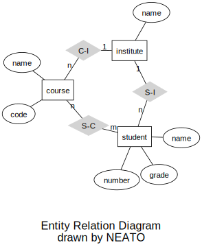
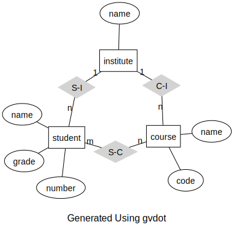
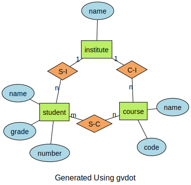

.. currentmodule:: gvdot

Entity Relationship Diagram
===========================

The Graphviz gallery includes `a Chen-style entity relationship diagram
<https://graphviz.org/Gallery/neato/ER.html>`_.  We can reproduce that example
by transcribing the gallery's `DOT language input file
<https://graphviz.org/Gallery/neato/ER.gv.txt>`_ to gvdot calls.

.. code:: python

    dot = Dot().graph(layout="neato")
    dot.all_default(fontname="Helvetica,Arial,sans-serif")

    dot.node_role("entity",shape="box")
    dot.node_role("attribute",shape="ellipse")
    dot.node_role("relationship",shape="diamond",style="filled",color="lightgrey")

    dot.node('course', role="entity")
    dot.node('institute', role="entity")
    dot.node('student', role="entity")

    dot.node('name0', label='name', role="attribute")
    dot.node('name1', label='name', role="attribute")
    dot.node('name2', label='name', role="attribute")

    dot.node('code', role="attribute")
    dot.node('grade', role="attribute")
    dot.node('number', role="attribute")

    dot.node('C-I', role="relationship")
    dot.node('S-C', role="relationship")
    dot.node('S-I', role="relationship")

    dot.edge('name0', 'course')
    dot.edge('code', 'course')
    dot.edge('course', 'C-I', label='n', len=1.0)
    dot.edge('C-I', 'institute', label='1', len=1.0)
    dot.edge('institute', 'name1')
    dot.edge('institute', 'S-I', label='1', len=1.0)
    dot.edge('S-I', 'student', label='n', len=1.0)
    dot.edge('student', 'grade')
    dot.edge('student', 'name2')
    dot.edge('student', 'number')
    dot.edge('student', 'S-C', label='m', len=1.0)
    dot.edge('S-C', 'course', label='n', len=1.0)

    dot.graph(fontsize=20, label='\n\nEntity Relation Diagram\ndrawn by NEATO')

    dot.show(size="5,5")

Aside from method calls instead of DOT statements, the primary difference
between the original DOT file and the transcription is that the DOT file
restates node defaults three times to reduce explicit attribute value
assignments, while the code uses gvdot roles.

    The transcription output matches the original.

Restating defaults is convenient when writing DOT by hand, but it can be
awkward when programmatically generating DOT directly because it forces code to
group together nodes and edges in a way that may be inconsistent with the
structure of the code's input. That's not a problem for gvdot applications
because gvdot supports order independence and roles.

Suppose we want to generate diagrams from ER models represented by the
following classes.

.. code:: python

    @dataclass
    class Entity:
        name : str
        attributes : list[str]

    @dataclass
    class Participant:
        entity : str
        cardinality : str

    @dataclass
    class Relationship:
        name : str
        participants : list[Participant]

    @dataclass
    class Model:
        entities : list[Entity]
        relationships : list[Relationship]

Let's create a model based on the gallery example.

.. code:: python

    example_model = Model(
        entities = [
            Entity("course",["name","code"]),
            Entity("institute",["name"]),
            Entity("student",["name","number","grade"]),
        ],
        relationships = [
            Relationship("C-I",[
                Participant("course","n"),
                Participant("institute","1")]),
            Relationship("S-I",[
                Participant("institute","1"),
                Participant("student","n")]),
            Relationship("S-C",[
                Participant("course","n"),
                Participant("student","m"),
            ])
        ])

Chen ER-diagrams use rectangles for entities, ellipses for attributes, and
diamonds for relationships.  We define an ER-diagram theme with those shapes.
We also choose the same font and layout engine as the gallery, and define edge
roles as well.

.. code:: python

    er_base_theme = (Dot()
        .graph(layout="neato")
        .all_default(fontname="Helvetica,Arial,sans-serif")
        .node_role("entity", shape="box")
        .node_role("attribute", shape="ellipse")
        .node_role("relationship", shape="diamond")
        .edge_role("e-to-r", len=1.0)  # entity-to-relationship
        .edge_role("a-to-e"))          # attribute-to-entity

The gallery example uses a solid light grey for relationships, so we specialize
the theme a bit.

.. code:: python

    er_gallery_theme = (Dot().use_theme(er_base_theme)
        .node_role("relationship", style="filled", color="lightgrey"))

Now we write our code to generate diagrams from models.  Observe there are no
presentation-related attribute assignments.  We could have them, of course, but
relying on roles and defaults from the theme makes the code easy to understand
and maintain.

.. code:: python

    def er_diagram(model:Model, title:str, theme:Dot) -> Dot:
        dot = Dot().use_theme(theme)
        for entity in model.entities:
            dot.node(entity.name, role="entity")
            for attribute in entity.attributes:
                attribute_id = Nonce("attribute")
                dot.node(attribute_id, role="attribute", label=attribute)
                dot.edge(entity.name, attribute_id, role="a-to-e")
        for relationship in model.relationships:
            dot.node(relationship.name, role="relationship")
            for participant in relationship.participants:
                dot.edge(relationship.name,participant.entity,
                        label=participant.cardinality, role="e-to-r")
        dot.graph(fontsize=16, label=f"\n{title}")
        return dot

    diagram = er_diagram(example_model, "Generated Using gvdot", er_gallery_theme)
    diagram.show(size="5,5")

Notice we use :class:`Nonce` objects to identify attribute nodes.  We can't use
attribute names because attribute names are not unique within a model.

    The layout differs because neato depends on statement order.

The generated diagram is equivalent to the transcribed version.  We can see how
gvdot incorporated the theme and roles by examining its DOT language
representation by either executing something like

.. code:: python

    print(diagram)

or in a notebook

.. code:: python

    diagram.show_source()

which displays

.. code:: graphviz

    graph {

        graph [fontname="Helvetica,Arial,sans-serif"]
        node [fontname="Helvetica,Arial,sans-serif"]
        edge [fontname="Helvetica,Arial,sans-serif"]

        layout=neato
        fontsize=16

        course [shape=box]
        attribute_1 [label="name" shape=ellipse]
        attribute_2 [label="code" shape=ellipse]
        institute [shape=box]
        attribute_3 [label="name" shape=ellipse]
        student [shape=box]
        attribute_4 [label="name" shape=ellipse]
        attribute_5 [label="number" shape=ellipse]
        attribute_6 [label="grade" shape=ellipse]
        "C-I" [shape=diamond style=filled color=lightgrey]
        "S-I" [shape=diamond style=filled color=lightgrey]
        "S-C" [shape=diamond style=filled color=lightgrey]

        course -- attribute_1
        course -- attribute_2
        institute -- attribute_3
        student -- attribute_4
        student -- attribute_5
        student -- attribute_6
        "C-I" -- course [label="n" len=1.0]
        "C-I" -- institute [label="1" len=1.0]
        "S-I" -- institute [label="1" len=1.0]
        "S-I" -- student [label="n" len=1.0]
        "S-C" -- course [label="n" len=1.0]
        "S-C" -- student [label="m" len=1.0]

        label="\nGenerated Using gvdot"
    }

The gallery theme is quite plain looking.  Let's render something with color.
All we need to do is change the theme – we don't even need to rebuild the
diagram.

.. code:: python

    er_color_theme = (Dot().use_theme(er_base_theme)
        .node_role("entity",style="filled",fillcolor="darkolivegreen2")
        .node_role("attribute",style="filled",fillcolor="lightblue")
        .node_role("relationship",style="filled",fillcolor="sandybrown"))

    diagram.use_theme(er_color_theme)
    diagram.show(size="5,5")

    Much nicer.

Let's save this one.

.. code:: python

    diagram.save("er-diagram.svg")

You can run the Entity Relationship Diagram example yourself by downloading the
`notebook from GitHub
<https://github.com/escreven/gvdot/blob/main/examples/er-diagram.ipynb>`_.
