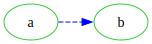
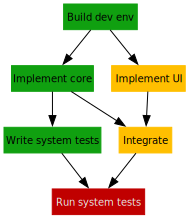

.. currentmodule:: gvdot

.. |br| raw:: html

   <br />

Overview
========

.. _class-dot:

Class Dot
---------

The DOT language defines the input format accepted by Graphviz, a family of
programs for drawing graphs.  Class :class:`Dot` is a DOT language graph
expression.  To produce a diagram, applications create a dot object then use it
to define and amend nodes, edges, and subgraphs, as well as graph-level
attribute values.  Applications can style diagrams with themes and roles, gvdot
features that help programmers separate presentation from structure.

Once complete, applications can convert a dot object to DOT language text or
render it as SVG or an image.  Notebook users can also interactively display
dot objects in Jupyter notebooks.

The string representation of a dot object is DOT language text, the same text
used when rendering the dot object.  For example,

.. code-block:: python

    dot = Dot(directed=True)
    dot.graph(rankdir="LR", labelloc="t", label="Rolling Back")
    dot.node("old", color="green", label=Markup("d<sub>k</sub>"))
    dot.node("new", color="red", label=Markup("d<sub>k+1</sub>"))
    dot.edge("old", "new", label="apply")
    dot.edge(Port("new",cp="s"), Port("old",cp="s"), label="undo")
    print(dot)

produces

.. code-block:: graphviz

    digraph {
        rankdir=LR
        labelloc=t
        old [color=green label=<d<sub>k</sub>>]
        new [color=red label=<d<sub>k+1</sub>>]
        old -> new [label="apply"]
        new:s -> old:s [label="undo"]
        label="Rolling Back"
    }

and

.. code-block:: python

    with open("rollback.svg", "w") as f:
        print(dot.to_svg(),file=f)

renders that DOT language text as the SVG file

.. image:: _static/rollback.svg
    :align: center
    :alt: Example NFA diagram

.. _statement-order:

|br| :class:`Dot` always produces DOT language statements and other lines in
the following order, regardless of the order in which defining :class:`Dot`
methods are called.

- Optional comment lines.
- The graph header and opening bracket (Example: ``graph mygraph {``)
- At most one graph default attributes statement.
- At most one node default attributes statement.
- At most one edge default attributes statement.
- All graph attribute assignments, excluding "label".
- One node statement per defined node.
- One (non-multigraph) or more (multigraph) edge statement per defined edge.
- Subgraphs.  Each subgraph consists of multiple lines following the same
  order as this list, except that subgraphs do not have comments and begin
  with a subgraph header.
- The graph "label" attribute, if any.  (The reason for this special case is
  that a Graphviz graph label assignment is inherited by any subgraph that
  follows it, which is undesirable.)
- The graph closing bracket

:class:`Dot` takes steps to produce readable DOT language representations:
it indents reasonably, avoids unnecessary :type:`ID` quoting (see below), and
separates sections with blank lines unless there are few statements.

IDs
---

The DOT language grammar uses non-terminal `ID` for both entity identifiers and
attribute values.  Lexically, an `ID` can be an unquoted character sequence
that looks like a number or programming language identifier, a quoted string,
or a Graphviz HTML string.  (See :class:`Markup`).  Regardless of how they
appear, there is no type differentiation between non-HTML IDs: in DOT language,
``1.23`` and ``"1.23"`` are two ways to write the same thing.

:class:`Dot` is consistent with the DOT grammar.  The ``edge()`` call of

.. code-block:: python

    dot.node(100)
    dot.node(101)
    dot.edge("100","101")

creates an edge between the two defined nodes.

HTML IDs are distinct from non-HTML IDs.  Python :type:`ID` values
``"the<br/>end"`` and ``Markup("the<br/> end")`` have the DOT language
representations ``"the<br/>end"`` and ``<the<br/>end>``.  When used as a label,
Graphviz renders the first as text containing angle brackets and a slash, and
the second as "the" and "end" on two lines.

For convenience, because some Graphiz attributes have boolean values specified
as ``true`` or ``false``, Python bool :type:`ID` values normalize to those
lowercase forms.

Attributes
-----------

Applications specify graph, node, and edge attributes as keyword arguments to
dot object methods.  Each keyword except for ``role`` should be a Graphviz
attribute name and each value should be an :type:`ID` or ``None``.  Value
``None`` deletes the attribute from the target entity if it was previously
specified, and is ignored if not.

Running the following as a cell in a notebook

.. code-block:: python

    dot = Dot(directed=True)
    dot.graph(rankdir="LR")
    dot.all_default(color="limegreen")
    dot.edge("a", "b", color="blue", style="dashed")
    dot.show()

    # That edge looks terrible.  Let's just use the default.
    dot.edge("a", "b", color=None)
    dot.show()

displays two images:



and

.. image:: _static/change-mind-2.svg
    :align: center
    :alt: Better edge diagram

|br|
One Graphviz attribute, ``class``, is also a Python reserved name.  To enable
applications to specify a value for ``class`` and any future conflicting
attribute, :class:`Dot` strips one trailing underscore character from attribute
keywords if present.  Example:

.. code-block:: python

    dot.node("a", class_="important", shape_="circle")

Node ``a`` will have SVG element class ``"important"`` and shape ``"circle"``.
The underscore is required for class, and superfluous for shape.


Roles
-----

If you're familiar with Graphviz, you may wonder if the :ref:`rigid statement
order <statement-order>` described above precludes a common technique:
restating default attributes to avoid explicitly assigning attributes to
particular nodes or edges.  Something like

- writing ``node [color="#10a010"]`` (green), then
- writing statements naming nodes deemed "normal", then
- writing ``node [color="#c00000", fontcolor="#e8e8e8"]`` (dark red with
  white text), then
- writing statements naming nodes deemed "critical", and so on.

The answer is yes --- by design.  Having to group nodes or edges together to
share a set of attribute values is awkward if the structure of the input
driving the generation does not coincide with that grouping.  Instead, gvdot
applications can assemble diagrams in any sequence that is convenient and
assign common attributes using roles.

A role is a named collection of attribute values similar to default node or
edge attributes.  Using the special attribute ```role```, applications may
assign a role to a node, edge, or graph, causing that entity to inherit the
role's attribute values.  Suppose we are modeling projects with

.. code-block:: python

    @dataclass
    class Task:
        id       : str
        name     : str
        requires : tuple[str, ...] = ()  # a tuple of task ids
        status   : str = "normal"        # or "atrisk" or "critical"

    @dataclass
    class Project:
        tasks: dict[str,Task]
        def __init__(self, tasklist:list[Task]):
            self.tasks = { task.id: task for task in tasklist }

We can generate a project task diagram with

.. code-block:: python

    def task_diagram(project:Project):
        dot = Dot(directed=True)
        dot.node_default(shape="box", margin=0.1, style="filled",
                         fontsize=10, fontname="sans-serif",
                         width=0, height=0)
        dot.node_role("normal", color="#10a010")
        dot.node_role("atrisk", color="#ffbf00")
        dot.node_role("critical", color="#c00000", fontcolor="#e8e8e8")

        for id, task in project.tasks.items():
            dot.node(id, label=task.name, role=task.status)
            for other in task.requires:
                dot.edge(other, id)
        return dot

We assign a role to task nodes based on (and in this case with the same name
as) the task's status.  The presentation attributes of the node are captured by
the role.  The resulting diagram might look like



|br|
Roles are not a DOT language feature, and other than the effect they have on
entity attributes do not appear in the DOT language representation.  The
attribute name ``role`` is reserved by gvdot.  Only graphs, nodes, and edges
can have attribute ``role``.

A role need not be defined before it is assigned.  However, :class:`Dot` raises
an exception if an assigned role is not defined when the application creates a
DOT language representation.


Themes
------


Edge Identity
-------------

Consistent with the DOT language, only the `id` portion of a
:class:`Port` is relevant to edge identification.  In the code below,
the first statement defines an edge, and the second amends the same
edge's attributes.

.. code-block:: python

    dot = Dot()
    dot.edge(Port("a",cp="n"), Port("b","output","s"), color="blue")
    dot.edge("a","b",style="dashed")

The outcome of calling `edge()` with the endpoint node IDs of an
already defined edge depends on the constructor `multigraph` parameter
and whether or not a discriminant is specified.

- Non-multigraph: the defined edge is amended.
- Multigraph, no discriminant: a new edge is defined
- Multigraph, distinct discriminant: a new edge is defined
- Multigraph, same discriminant: the defined edge is amended

Scoping
-------

In DOT, node identifiers are scoped to the root graph, so nodes and
edges cannot be redefined within a child.  Also, nodes and edge
attributes can be amended through any dot object in the hierarchy,
regardless of the dot object through which they were defined.

Roles are similarly scoped to the root graph.  Role specifications or
amendments made through a subgraph dot object are visible throughout
the graph.

Subgraphs, on the other hand, are scoped to their parent.  So, the
assertions below all hold.

.. code:: python

    dot = Dot()
    sub1 = dot.subgraph(id="sub1")
    sub1_sub2 = sub1.subgraph(id="sub2")
    assert dot.subgraph(id="sub1") is sub1
    assert sub1.subgraph(id="sub2") is sub1_sub2
    assert dot.subgraph(id="sub2") is not sub1_sub2

Rendering
---------

`_define` and `_update`
-----------------------
