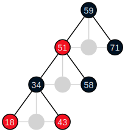

.. currentmodule:: gvdot

.. |br| raw:: html

    

Red-Black Trees
===============

Our goal is to produce examples for students learning about Robert
Sedgewick's `Left-leaning Red-Black Trees
<https://sedgewick.io/wp-content/themes/sedgewick/papers/2008LLRB.pdf>`_.

As usual, we begin by creating a theme.

.. code-block:: python

    rb_theme = (Dot()
        .all_default(penwidth=1.5)
        .node_default(
            fontname="Helvetica", fontsize=14, fontcolor="#eeeeee",
            style="filled", shape="circle", fixedsize=True, height=0.35)
        .edge_default(arrowhead="none")
        .node_role("red", fillcolor="#f31020")
        .node_role("black", fillcolor="#001122")
        .edge_role("phantom", style="invisible"))

Before we write the generation code, let's see what this looks like.  We force
nodes ``1`` and ``4`` to be on the same rank and ordered correctly with a
subgraph and a phantom (invisible) edge.

.. code-block:: python

    dot = Dot(directed=True).use_theme(rb_theme)
    dot.node(2, role="black")
    dot.node(1, role="black")
    dot.node(4, role="black")
    dot.node(3, role="red")
    dot.edge(2, 1)
    dot.edge(2, 4)
    dot.edge(4, 3)
    dot.subgraph().graph(rank="same").edge(1, 4, role="phantom")
    dot.save("images/rb-hand-initial.svg")
    dot.show()

.. image:: _static/examples/rb-hand-initial.*
    :align: center
    :alt: Initial hand-crafted red-black tree

|br|
The nodes look nice, but the children of ``2`` are crowded, and we can't
visually determine if ``3`` is the left or right child of ``4``.  We will solve
these problems by adding phantom nodes --- every parent will have three
children, including at least one phantom.

We add a phantom node role to the theme to accompany the existing phantom edge
role.

.. code-block:: python

    rb_theme.node_role("phantom", style="invisible", label="")

and use it in our hand-crafted tree.

.. code-block:: python

    dot = Dot(directed=True).use_theme(rb_theme)
    dot.node(2, role="black")
    dot.node(1, role="black")
    dot.node(4, role="black")
    dot.node(3, role="red")
    dot.node("phantom_1", role="phantom") # Child of 2, between 1 and 4
    dot.node("phantom_2", role="phantom") # Child of 4, right of 3
    dot.node("phantom_3", role="phantom") # Child of 4, rightmost

    dot.edge(2,1)
    dot.edge(2,"phantom_1", role="phantom")
    dot.edge(2,4)
    (dot.subgraph().graph(rank="same")
    .edge(1, "phantom_1", role="phantom")
    .edge("phantom_1", 4, role="phantom"))

    dot.edge(4,3)
    dot.edge(4,"phantom_2", role="phantom")
    dot.edge(4,"phantom_3", role="phantom")
    (dot.subgraph().graph(rank="same")
    .edge(3, "phantom_2", role="phantom")
    .edge("phantom_2", "phantom_3", role="phantom"))

    dot.save("images/rb-hand-updated.svg")
    dot.show()

.. image:: _static/examples/rb-hand-updated.*
    :align: center
    :alt: Improved hand-crafted red-black tree

|br|
Much better looking, but awfully tedious to construct by hand.  Time to
get programmatic.

We create a simple red-black tree implementation based on Sedgewick's paper.

.. code-block:: python

    RED   = 1
    BLACK = 0

    @dataclass
    class RBNode:
        key    : int
        color  : int = RED
        left   : RBNode | None = None
        right  : RBNode | None = None

    @dataclass
    class RBTree:
        root : RBNode | None = None

        def insert(self, key:int) -> None:
            self.root = _insert_node(self.root, key)
            self.root.color = BLACK

    # ... elided ...

(We have only shown what is necessary for the discussion below.  The full
implementation `is available on GitHub
<https://github.com/escreven/gvdot-work/blob/work/examples/red-black-tree.ipynb>`_.)

Now we write the generation code.

.. code-block:: python

    def rb_diagram(tree:RBTree) -> Dot:
        #
        # Yield tree nodes in pre-order sequence.
        #
        def traverse(node):
            if node:
                yield node
                yield from traverse(node.left)
                yield from traverse(node.right)
        #
        # Add a child of node to the diagram, a phantom if child is None.
        #
        phantom_index = 1
        def link(node:RBNode, child:RBNode|None) -> int|str:
            if child is not None:
                dot.edge(node.key, child.key)
                return child.key
            else:
                nonlocal phantom_index
                phantom_id = "_phantom_" + str(phantom_index)
                phantom_index += 1
                dot.node(phantom_id, role="phantom")
                dot.edge(node.key, phantom_id, role="phantom")
                return phantom_id
        #
        # Build the diagram with every node and tree edge, including phantoms.
        #
        dot = Dot(directed=True).use_theme(rb_theme)
        for node in traverse(tree.root):
            dot.node(node.key, role="red" if node.color == RED else "black")
            if node.left or node.right:
                c1 = link(node, node.left)
                c2 = link(node, None)
                c3 = link(node, node.right)
                subdot = dot.subgraph().graph(rank="same")
                subdot.edge(c1,c2,role="phantom").edge(c2,c3,role="phantom")

        return dot

All that is left is generating our examples.

.. code-block:: python

    from IPython.display import display, Markdown

    sequence = [ 71, 59, 58, 51, 43, 34, 18 ]

    tree = RBTree()
    tree.insert(sequence[0])

    display(Markdown(f"#### We start with {sequence[0]}:"))
    rb_diagram(tree).show()
    for key in sequence[1:]:
        tree.insert(key)
        display(Markdown(f"#### After inserting {key}:"))
        diagram = rb_diagram(tree)
        diagram.show()

.. list-table::
   :align: left
   :class: .gvdot-example-table

   * - We start with 71:
     - .. image:: _static/examples/rb-auto-71.*
        :align: center
        :height: 30px

   * - After inserting 59:
     - .. image:: _static/examples/rb-auto-59.*
        :align: center
        :height: 90px

   * - After inserting 58:
     - .. image:: _static/examples/rb-auto-58.*
        :align: center
        :height: 90px

   * - After inserting 51:
     - .. image:: _static/examples/rb-auto-51.*
        :align: center
        :height: 150px

   * - After inserting 43:
     - .. image:: _static/examples/rb-auto-43.*
        :align: center
        :height: 150px

   * - After inserting 34:
     - .. image:: _static/examples/rb-auto-34.*
        :align: center
        :height: 210px

   * - After inserting 18:
     - .. image:: _static/examples/rb-auto-18.*
        :align: center
        :height: 210px

The DOT language of our final tree diagram is

.. code-block:: graphviz

    digraph {

        graph [penwidth=1.5]
        node [penwidth=1.5 fontname=Helvetica fontsize=14 fontcolor="#eeeeee" style=filled shape=circle fixedsize=true height=0.35]
        edge [penwidth=1.5 arrowhead=none]

        59 [fillcolor="#001122"]
        _phantom_1 [style=invisible label=""]
        51 [fillcolor="#f31020"]
        _phantom_2 [style=invisible label=""]
        34 [fillcolor="#001122"]
        _phantom_3 [style=invisible label=""]
        18 [fillcolor="#f31020"]
        43 [fillcolor="#f31020"]
        58 [fillcolor="#001122"]
        71 [fillcolor="#001122"]

        59 -> 51
        59 -> _phantom_1 [style=invisible]
        59 -> 71
        51 -> 34
        51 -> _phantom_2 [style=invisible]
        51 -> 58
        34 -> 18
        34 -> _phantom_3 [style=invisible]
        34 -> 43

        subgraph {
            rank=same
            51 -> _phantom_1 [style=invisible]
            _phantom_1 -> 71 [style=invisible]
        }

        subgraph {
            rank=same
            34 -> _phantom_2 [style=invisible]
            _phantom_2 -> 58 [style=invisible]
        }

        subgraph {
            rank=same
            18 -> _phantom_3 [style=invisible]
            _phantom_3 -> 43 [style=invisible]
        }
    }

To better understand what the phantoms contributed, we can make them visible.
We don't need to modify the diagram; we just amend the phantom roles in the
theme.

.. code-block:: python

    rb_theme.node_role("phantom", style=None, color="lightgray")
    rb_theme.edge_role("phantom", style=None, color="lightgray")
    diagram.show()

